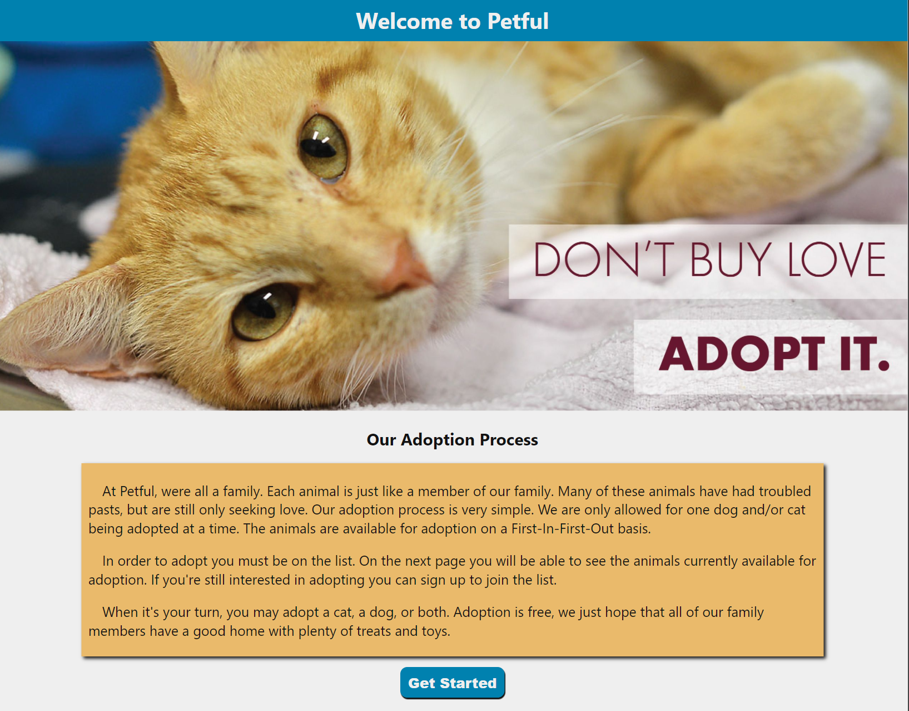
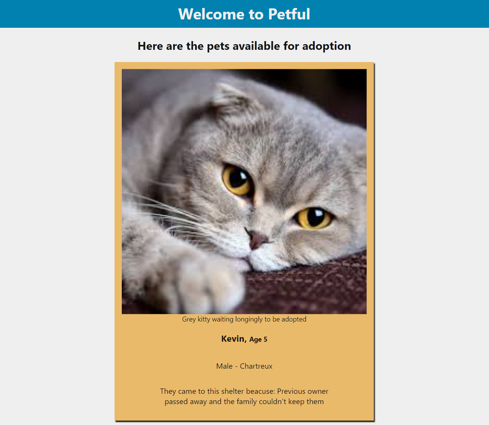
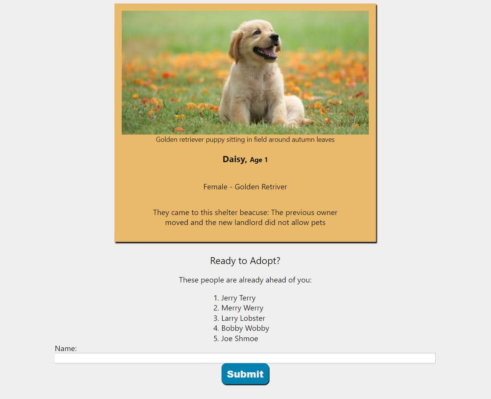

# Petful Client

## Hosted at:
https://petful-client-eosin.vercel.app/

This app is a simple DSA practice for the Thinkful program. 

The data is structured into Queues.
You can sign up to join the queue and see as your position moves up in line as people are dequeued.

At Petful, we're all a family. Each animal is just like a member of our family. Many of these animals have had troubled pasts, but are still only seeking love. Our adoption process is very simple. We are only allowed for one dog and/or cat being adopted at a time. The animals are available for adoption on a First-In-First-Out basis.

In order to adopt you must be on the list. On the next page you will be able to see the animals currently available for adoption. If you're still interested in adopting you can sign up to join the list.

When it's your turn, you may adopt a cat, a dog, or both. Adoption is free, we just hope that all of our family members have a good home with plenty of treats and toys.

### Created with React, Node, and Express

### Screen Shots

